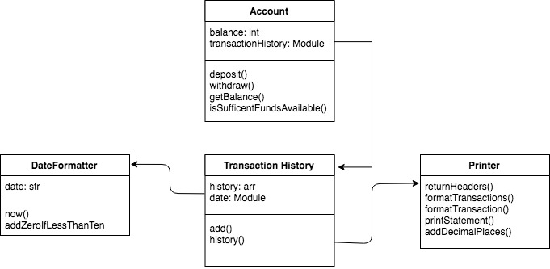

# Bank Tech Test

## Approach

After going over the spec a few times, I broke the test down into user stories (included below). From there I broke the classes down and created a domain model of how the program would sort of look.

I chose Jasmine as my testing framework of choice due to the fact that I had used it during the course. I structured my code so it was modular and simple to read. This could be test could be broken down more, but I realized that it would take too much time to implement. I was happy at the tests as I approached them in a more behavioral way, and managed to attain a 100% test coverage across the test.

## Things to Improve On

Some things I feel I could improve on in this code, include the use of mocks within the tests. I also feel I need to work on my approach to domain modeling to get a clearer picture of how the program will take shape earlier on in the development process.

## Specification

### Requirements

* You should be able to interact with your code via a REPL like IRB or the JavaScript console.  (You don't need to implement a command line interface that takes input from STDIN.)
* Deposits, withdrawal.
* Account statement (date, amount, balance) printing.
* Data can be kept in memory (it doesn't need to be stored to a database or anything).

### Acceptance criteria

**Given** a client makes a deposit of 1000 on 10-01-2012  
**And** a deposit of 2000 on 13-01-2012  
**And** a withdrawal of 500 on 14-01-2012  
**When** she prints her bank statement  
**Then** she would see

```
date || credit || debit || balance
14/01/2012 || || 500.00 || 2500.00
13/01/2012 || 2000.00 || || 3000.00
10/01/2012 || 1000.00 || || 1000.00
```

## Testing

Testing were designed and are to be ran using the Jasmine NPM package. Ensure you have NPM installed and have this repository cloned. Once inside of the directory type `npm install` to download to the packages.

To run the tests and see the code coverage, run `npm test`

## Instructions

To run the acceptance script type in `node index.js`.
```
// expected output
date || credit || debit || balance
24/04/2018 || -500.00 || 2500.00
24/04/2018 || 2000.00 || 3000.00
24/04/2018 || 1000.00 || 1000.00
```


## Tech Used
- JavaScript
- Jasmine
- Istanbul (JS Code Coverage Tool)
- Node Package Manager

### User stories

```
As an account holder
So that I can withdraw money in the future
I would like to store an amount of money into a account
```

```
As an account holder
So that I can have money to spend on goods
I would like to withdraw an amount of money from my account
```

```
As an account holder
So that I can see my account actions
I would like to see a printed statement of my bank history
```

```
As an account holder
So I that I can easily read my statement
I would like to see my statement in descending order
```

### Domain Model

